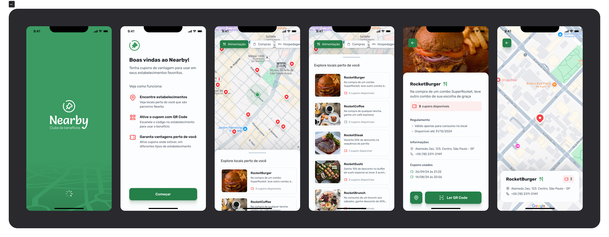

# Nearby App

<p align="center">
  
</p>

Nearby App é um aplicativo mobile de clube de benefícios, que permite aos usuários acessar cupons para utilização em estabelecimentos próximos. A aplicação oferece uma experiência interativa com mapas, localização em tempo real e interações fluidas com animações.

---

## 🚀 Tecnologias

Este projeto foi desenvolvido utilizando as seguintes tecnologias:

### Mobile

- [React Native](https://reactnative.dev/)
- [Expo](https://expo.dev/)
- [TypeScript](https://www.typescriptlang.org/)
- [React Navigation](https://reactnavigation.org/)
- [Expo Location](https://docs.expo.dev/versions/latest/sdk/location/)
- [React Native Maps](https://github.com/react-native-maps/react-native-maps)
- [Axios](https://axios-http.com/)
- [Gorhom Bottom Sheet](https://gorhom.github.io/react-native-bottom-sheet/)
- [Expo Splash Screen](https://docs.expo.dev/versions/latest/sdk/splash-screen/)
- [Expo Camera](https://docs.expo.dev/versions/latest/sdk/camera/)
- [Expo Font](https://docs.expo.dev/guides/using-custom-fonts/)
- [Tabler Icons](https://tabler-icons.io/)
- [React Native Gesture Handler](https://docs.swmansion.com/react-native-gesture-handler/)
- [React Native Reanimated](https://docs.swmansion.com/react-native-reanimated/)

### Backend

- [Node.js](https://nodejs.org/)
- [Express](https://expressjs.com/)
- [Prisma](https://www.prisma.io/)
- [SQLite](https://www.sqlite.org/)
- [Zod](https://zod.dev/)

---

## 💻 Funcionalidades

- **Localização em tempo real**: Mostra os estabelecimentos próximos ao usuário utilizando mapas interativos.
- **Listagem de cupons**: Exibe uma lista de cupons de descontos para uso em estabelecimentos locais.
- **Mapas Interativos**: Visualização de locais no mapa com interações via bottom sheet.
- **Envio de cupons**: Possibilidade de adicionar cupons de novos estabelecimentos.
- **Interações fluídas**: Animações e transições suaves para uma melhor experiência do usuário.

---

## 🌈 Layout

O layout do projeto pode ser visualizado no Figma clicando [aqui](<https://www.figma.com/design/QIlx6XBwoAuVYYF7g4yeN6/NLW-Pocket-Mobile-%E2%80%A2-Nearby-(Community)?node-id=3-809&t=zvH4tMoCSowS1XSw-0>).

---

## 🚪 Configuração e Execução

### Requisitos

- Node.js instalado
- Expo CLI instalado
- Um dispositivo móvel ou emulador para executar o aplicativo

### Passos para executar o projeto

1. **Clone o repositório:**

   ```bash
   git clone https://github.com/seu-usuario/nearby-app.git
   ```

2. **Acesse a pasta do projeto:**

   ```bash
   cd nearby-app
   ```

3. **Instale as dependências:**

   ```bash
   npm install
   ```

4. **Inicie o projeto:**

   ```bash
   npx expo start
   ```

5. **Execução em dispositivo:**
   - Escaneie o QR Code gerado com o aplicativo Expo Go (disponível na Play Store e App Store).
   - Ou utilize um emulador/simulador para executar o aplicativo.

---

## 🔒 Backend

Para executar o backend:

1. **Acesse a pasta do backend:**

   ```bash
   cd backend
   ```

2. **Instale as dependências:**

   ```bash
   npm install
   ```

3. **Rode as migrações do Prisma:**

   ```bash
   npx prisma migrate dev
   ```

4. **Inicie o servidor:**
   ```bash
   npm run dev
   ```

---
